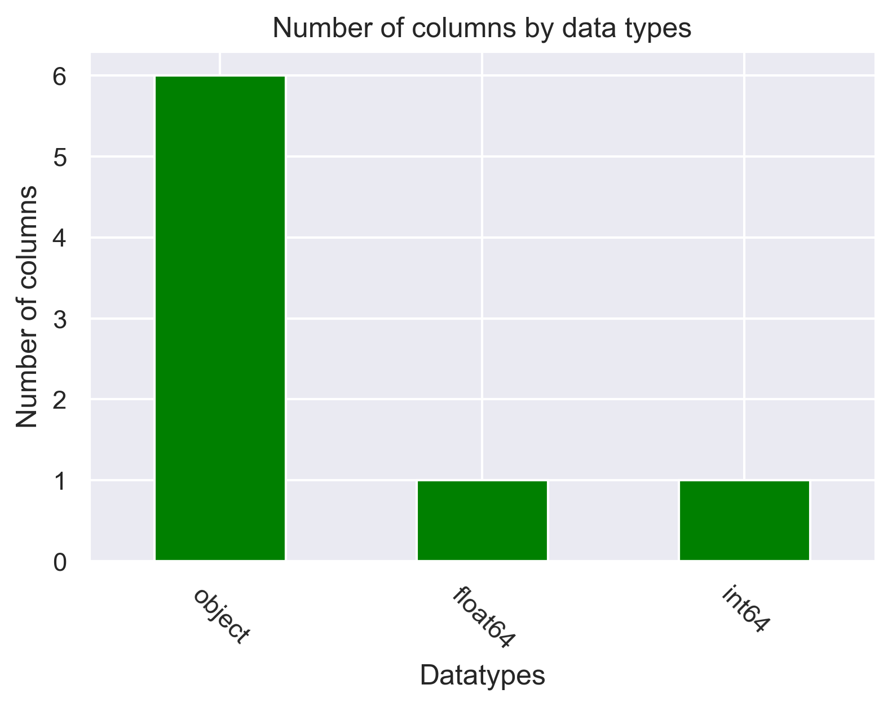
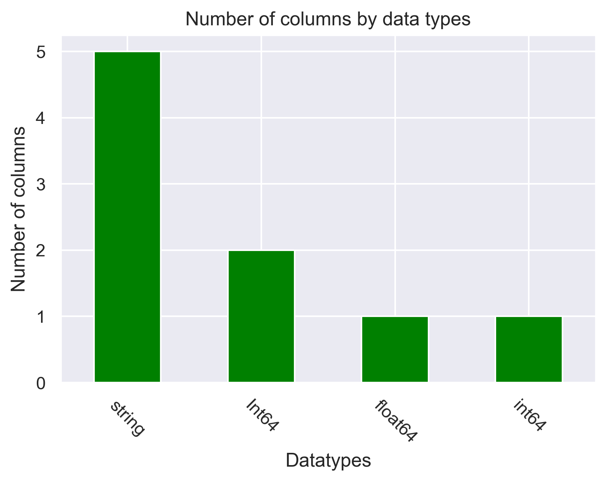
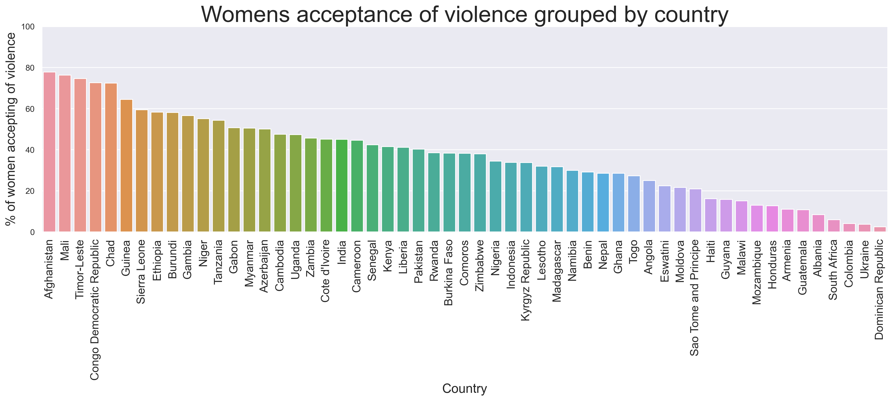
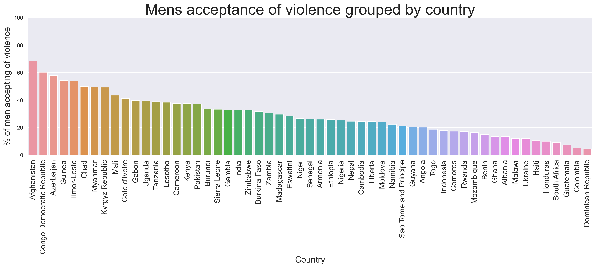
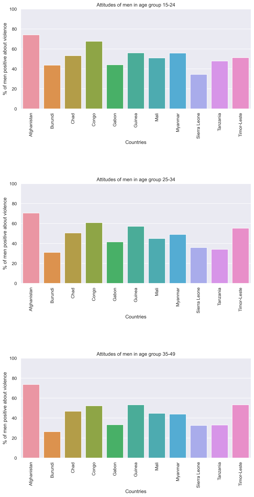
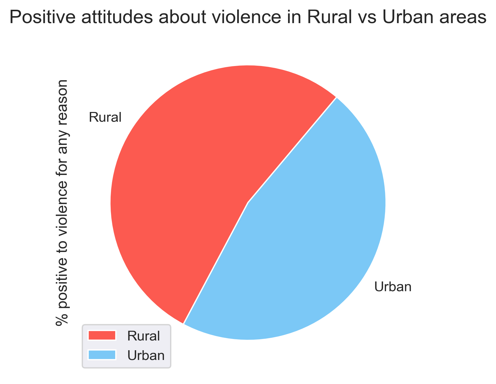
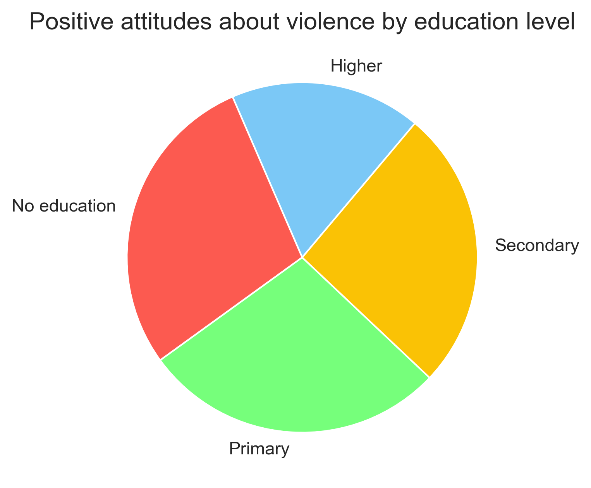
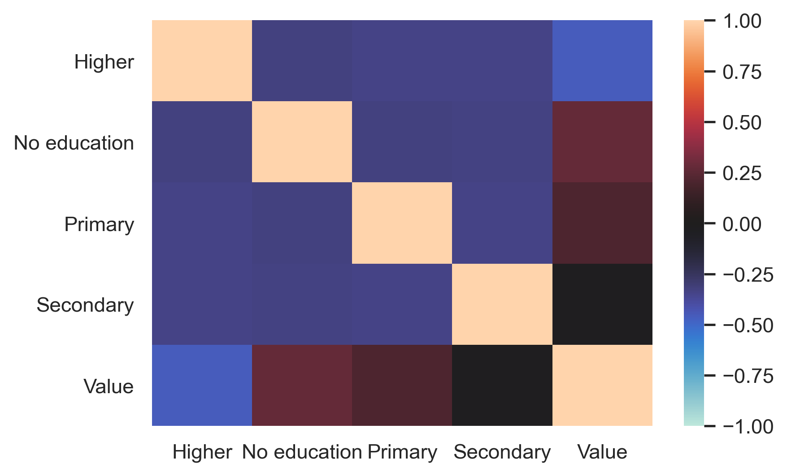
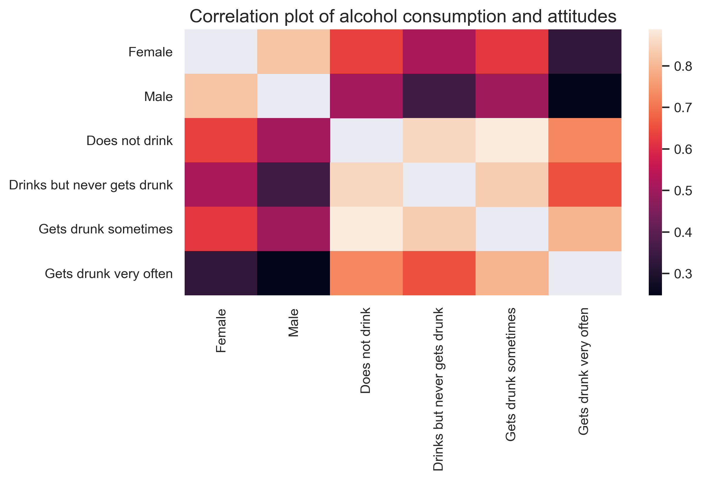

# Violence against women and girls

> "A higher proportion of women than men think that violence against them can be justified."
> [Source](https://public.tableau.com/profile/operation.fistula6589#!/vizhome/Internationaldayfortheeliminationofviolenceagainstwomen/Violenceagainstwomen)

[@Eva Murray](https://data.world/evamurray) have published a dataset on [data.world](https://data.world/makeovermonday/2020w10) displaying what women and men thinks about violence against women.

Original publish date: November 25th, 2019

Last updated: March 8th, 2020

Accessed: November, 2020

The dataset is publicly available at [data.world/dataset](https://data.world/makeovermonday/2020w10/workspace/file?filename=20200306+Data+International+Women%27s+Day+Viz5+Launch.csv)

```python
import numpy as np
import pandas as pd
import matplotlib.pyplot as plt
from matplotlib import rcParams
from sklearn.tree import DecisionTreeRegressor, export_graphviz
from sklearn.model_selection import train_test_split
from sklearn.metrics import confusion_matrix
from sklearn.naive_bayes import GaussianNB
from scipy import stats
import seaborn as sns
sns.set()
plt.rcParams["figure.dpi"] = 300
#plt.rcParams["savefig.dpi"] = 300

df = pd.read_csv('https://query.data.world/s/mkjaumem4rmiobndsks4zd34uzd5kr')
```

# About the data

The data is collected by the Demographic and Health Surveys (DHS) Program, which has the purpose to advance the global understandning of health and populuation in developing countries.

The geographical target areas are, Africa, Asia and South America across 70 countries in total.

**Explain all features below**
Name, type, desc

# Preprocessing

```python
df.info()
```

    <class 'pandas.core.frame.DataFrame'>
    RangeIndex: 12600 entries, 0 to 12599
    Data columns (total 8 columns):
     #   Column                 Non-Null Count  Dtype
    ---  ------                 --------------  -----
     0   RecordID               12600 non-null  int64
     1   Country                12600 non-null  object
     2   Gender                 12600 non-null  object
     3   Demographics Question  12600 non-null  object
     4   Demographics Response  12600 non-null  object
     5   Question               12600 non-null  object
     6   Survey Year            12600 non-null  object
     7   Value                  11187 non-null  float64
    dtypes: float64(1), int64(1), object(6)
    memory usage: 787.6+ KB

```python
print("The dataset consists of {:} rows and {:} columns.".format(df.shape[0], df.shape[1]))
```

    The dataset consists of 12600 rows and 8 columns.

#### Overview of data types

```python
barplot = df.dtypes.value_counts().plot.bar(color="green");
plt.title("Number of columns by data types")
plt.xlabel("Datatypes")
plt.ylabel("Number of columns")
plt.xticks(rotation=-45)
plt.show(barplot)
```



## Look at NA values

By looking at the dataframe info, it shows the value - the percentage of agreement of violence, have null values.

```python
df[df["Value"].isna()]["Question"].value_counts()
```

    ... if she burns the food                  271
    ... if she argues with him                 271
    ... if she refuses to have sex with him    238
    ... if she neglects the children           211
    ... if she goes out without telling him    211
    ... for at least one specific reason       211
    Name: Question, dtype: int64

Showing countries and question where value is N/A

```python
df[df["Value"].isna()]["Country"].value_counts()
```

    Turkey                   102
    Egypt                     96
    Bangladesh                96
    Tajikistan                90
    Yemen                     90
    Turkmenistan              90
    Morocco                   90
    Eritrea                   90
    Peru                      90
    Bolivia                   90
    Nicaragua                 90
    Philippines               90
    Congo                     60
    Maldives                  60
    Jordan                    45
    Ukraine                   24
    Kyrgyz Republic           18
    Moldova                   18
    Pakistan                  12
    Afghanistan               12
    Azerbaijan                12
    Indonesia                 12
    Armenia                   12
    Dominican Republic        12
    South Africa               6
    Sao Tome and Principe      6
    Name: Country, dtype: int64

These results shows that some countries have half and more than half of their responses not tracked. These countries will be dropped in order to have a more uniform dataset.

Will drop all countries were the occurences of missing values are more than 20% occurences of countries.

```python
occurence_country = df["Country"].value_counts().mean()
prune_countries = df[df["Value"].isna()]["Country"].value_counts() > occurence_country*0.2
removals = prune_countries[prune_countries == True].index
removals
df = df[~df["Country"].isin(removals)]
df.info()
```

    <class 'pandas.core.frame.DataFrame'>
    Int64Index: 9900 entries, 0 to 12599
    Data columns (total 8 columns):
     #   Column                 Non-Null Count  Dtype
    ---  ------                 --------------  -----
     0   RecordID               9900 non-null   int64
     1   Country                9900 non-null   object
     2   Gender                 9900 non-null   object
     3   Demographics Question  9900 non-null   object
     4   Demographics Response  9900 non-null   object
     5   Question               9900 non-null   object
     6   Survey Year            9900 non-null   object
     7   Value                  9756 non-null   float64
    dtypes: float64(1), int64(1), object(6)
    memory usage: 696.1+ KB

Countries with NA values, but are kept.

```python
kept = prune_countries[prune_countries == False].index
for k in kept.sort_values():
  print(k)
```

    Afghanistan
    Armenia
    Azerbaijan
    Dominican Republic
    Indonesia
    Kyrgyz Republic
    Moldova
    Pakistan
    Sao Tome and Principe
    South Africa
    Ukraine

Remove the rows with NA value. As seen above, only the column _Value_ have NA values.

```python
df = df.dropna(axis=0, how='any')
```

Complete dataset without any NA values.

```python
df.info()
```

    <class 'pandas.core.frame.DataFrame'>
    Int64Index: 9756 entries, 1 to 12599
    Data columns (total 8 columns):
     #   Column                 Non-Null Count  Dtype
    ---  ------                 --------------  -----
     0   RecordID               9756 non-null   int64
     1   Country                9756 non-null   object
     2   Gender                 9756 non-null   object
     3   Demographics Question  9756 non-null   object
     4   Demographics Response  9756 non-null   object
     5   Question               9756 non-null   object
     6   Survey Year            9756 non-null   object
     7   Value                  9756 non-null   float64
    dtypes: float64(1), int64(1), object(6)
    memory usage: 686.0+ KB

Looking for any empty strings

```python
numEmpty = (df.select_dtypes(include=["object"]) == "").sum().sum()
print("Number of empty strings: {}".format(numEmpty))
```

    Number of empty strings: 0

No empty string found.

Verify that it is no NA values left in the dataset.

```python
# Verify no na values
print("Number of NA values: \n{}.".format(df.isna().sum()))
```

    Number of NA values:
    RecordID                 0
    Country                  0
    Gender                   0
    Demographics Question    0
    Demographics Response    0
    Question                 0
    Survey Year              0
    Value                    0
    dtype: int64.

Convert to correct datatypes, set index as panda time, update gender column to 0 and 1 representing male and female respectively and validate no NA values.

```python
# Set index to survey year, to easilier deal with time calculations
# and sorting
df = df.set_index(pd.to_datetime(df['Survey Year']))

# Dropping survey year since its now the index
#df = df.drop(columns=["Survey Year"])

# Converting gender from string representation to int, Male=0, Female=1
df["Gender"] = (df["Gender"] == 'F').astype(int)

# Convert object to string
df = df.convert_dtypes()

df["Survey"] = df.index.year

```

```python
df.info()
```

    <class 'pandas.core.frame.DataFrame'>
    DatetimeIndex: 9756 entries, 2015-01-01 to 2015-01-01
    Data columns (total 9 columns):
     #   Column                 Non-Null Count  Dtype
    ---  ------                 --------------  -----
     0   RecordID               9756 non-null   Int64
     1   Country                9756 non-null   string
     2   Gender                 9756 non-null   Int64
     3   Demographics Question  9756 non-null   string
     4   Demographics Response  9756 non-null   string
     5   Question               9756 non-null   string
     6   Survey Year            9756 non-null   string
     7   Value                  9756 non-null   float64
     8   Survey                 9756 non-null   int64
    dtypes: Int64(2), float64(1), int64(1), string(5)
    memory usage: 781.2 KB

```python
barplot = df.dtypes.value_counts().plot.bar(color="green");
plt.title("Number of columns by data types")
plt.xlabel("Datatypes")
plt.ylabel("Number of columns")
plt.xticks(rotation=-45)
plt.show(barplot)
```



## Conclusion of data cleaning

Some countries in this dataset are not well represented with their survey results. In order to have more of a uniform dataset to work with, these countries have been dropped.

```python
print("Countries dropped: \n")
for country in removals.sort_values():
  print(country)
```

    Countries dropped:

    Bangladesh
    Bolivia
    Congo
    Egypt
    Eritrea
    Jordan
    Maldives
    Morocco
    Nicaragua
    Peru
    Philippines
    Tajikistan
    Turkey
    Turkmenistan
    Yemen

Working with a dataset it is important to get to know the dataset. This includes number of rows, columns, representation of elements and datatypes. Data representation will follow in the next section. Final results of the cleaned dataset is as follows:

```python
print("The dataset consists of {:} rows and {:} columns.".format(df.shape[0], df.shape[1]))
```

    The dataset consists of 9756 rows and 9 columns.

```python
print("Datatypes: {}".format([print(l) for l in df.dtypes.value_counts().index.unique()]))

```

    string
    Int64
    float64
    int64
    Datatypes: [None, None, None, None]

```python
df.info()
```

    <class 'pandas.core.frame.DataFrame'>
    DatetimeIndex: 9756 entries, 2015-01-01 to 2015-01-01
    Data columns (total 9 columns):
     #   Column                 Non-Null Count  Dtype
    ---  ------                 --------------  -----
     0   RecordID               9756 non-null   Int64
     1   Country                9756 non-null   string
     2   Gender                 9756 non-null   Int64
     3   Demographics Question  9756 non-null   string
     4   Demographics Response  9756 non-null   string
     5   Question               9756 non-null   string
     6   Survey Year            9756 non-null   string
     7   Value                  9756 non-null   float64
     8   Survey                 9756 non-null   int64
    dtypes: Int64(2), float64(1), int64(1), string(5)
    memory usage: 781.2 KB

# Explore data

```python
df[(df["Country"] == "Afghanistan") & (df["Question"] == "... for at least one specific reason") & (df["Gender"] == 1)].describe()
```

<div>
<style scoped>
    .dataframe tbody tr th:only-of-type {
        vertical-align: middle;
    }

    .dataframe tbody tr th {
        vertical-align: top;
    }

    .dataframe thead th {
        text-align: right;
    }

</style>
<table border="1" class="dataframe">
  <thead>
    <tr style="text-align: right;">
      <th></th>
      <th>RecordID</th>
      <th>Gender</th>
      <th>Value</th>
      <th>Survey</th>
    </tr>
  </thead>
  <tbody>
    <tr>
      <th>count</th>
      <td>14.0</td>
      <td>14.0</td>
      <td>14.000000</td>
      <td>14.0</td>
    </tr>
    <tr>
      <th>mean</th>
      <td>351.0</td>
      <td>1.0</td>
      <td>77.857143</td>
      <td>2015.0</td>
    </tr>
    <tr>
      <th>std</th>
      <td>0.0</td>
      <td>0.0</td>
      <td>6.536373</td>
      <td>0.0</td>
    </tr>
    <tr>
      <th>min</th>
      <td>351.0</td>
      <td>1.0</td>
      <td>61.100000</td>
      <td>2015.0</td>
    </tr>
    <tr>
      <th>25%</th>
      <td>351.0</td>
      <td>1.0</td>
      <td>76.750000</td>
      <td>2015.0</td>
    </tr>
    <tr>
      <th>50%</th>
      <td>351.0</td>
      <td>1.0</td>
      <td>80.100000</td>
      <td>2015.0</td>
    </tr>
    <tr>
      <th>75%</th>
      <td>351.0</td>
      <td>1.0</td>
      <td>80.900000</td>
      <td>2015.0</td>
    </tr>
    <tr>
      <th>max</th>
      <td>351.0</td>
      <td>1.0</td>
      <td>86.900000</td>
      <td>2015.0</td>
    </tr>
  </tbody>
</table>
</div>

```python
data = df[(df["Question"]  == "... for at least one specific reason") & (df["Gender"] == 1)].groupby("Country")["Value"].mean().reset_index()

data.head()
sort = data.sort_values(by=["Value"], ascending=False)

plt.figure(figsize=(20,5))
ax = sns.barplot(x="Country", y="Value", data=sort, ci=None)
plt.title("Womens acceptance of violence grouped by country", size="30");
plt.ylabel("% of women accepting of violence", size="17");
plt.ylim(0,100);
plt.xlabel("Country", size="17");
plt.xticks(rotation=90, size="15")
plt.show()
```



```python
data = df[(df["Question"]  == "... for at least one specific reason") & (df["Gender"] == 0)].groupby("Country")["Value"].mean().reset_index()

data.head()
sort = data.sort_values(by=["Value"], ascending=False)

plt.figure(figsize=(20,5))
ax = sns.barplot(x="Country", y="Value", data=sort, ci=None)
plt.title("Mens acceptance of violence grouped by country", size="30");
plt.ylabel("% of men accepting of violence", size="17");
plt.ylim(0,100);
plt.xlabel("Country", size="17");
plt.xticks(rotation=90, size="15")
plt.show()
```



```python
d = df[(df["Question"]  == "... for at least one specific reason")].groupby("Country")["Value"].mean().reset_index()

countries = d[d["Value"] > 45]["Country"].unique()

countries.shape

demo =  df[(df["Question"]  == "... for at least one specific reason")].groupby(["Country", "Demographics Response", "Gender", "Demographics Question"])["Value"].mean().reset_index()
demo

response = demo["Demographics Response"].unique()
response

demo = demo[demo["Country"].isin(countries)]

demo.replace("Congo Democratic Republic", "Congo", inplace=True)

# Dropping Azerbaijan as they don't have values for men with these requirements
demo = demo[demo["Country"] != "Azerbaijan"]

plt.subplots(figsize=(25,100))

def plot_title(category, item):
    if category == "Age":
        return "Attitudes in age group " + item
    elif category == "Marital status":
        return "Attitudes of people " + item
    elif category == "Education":
        if "education" in item:
            return "Attitudes of people with " + item
        else:
            return "Attitudes of people with " + item + " education"
    elif category == "Residence":
        return "Attitude of people living in " + item + " areas"
    elif category == "Employment":
        return "Attitudes of people " + item
    else:
        return "Categeory: " + category + " - group: " + item

for i, resp in enumerate(response):
    plt.subplot(len(response), 2, i+1)
    data = demo[demo["Demographics Response"] == resp].reset_index()
    ax = sns.barplot(x="Country", y="Value", hue="Gender", data=data, ci=None)
    demo_question = demo[demo["Demographics Response"] == resp]["Demographics Question"].unique()
    #ax.set_title("Attitudes of people living in " + resp + " areas")
    title = plot_title(demo_question, resp)
    ax.set_title(title)
    ax.set_ylim(0,100)
    plt.xlabel("% of people positive about violence")
    plt.xticks(rotation=90)
    plt.legend(labels=(["Male", "Female"]))


plt.subplots_adjust(hspace = 0.75)
plt.figure(figsize=(20,4))
plt.show()

```


    <Figure size 6000x1200 with 0 Axes>

```python
demo["Demographics Response"].unique()
```

    array(['15-24', '25-34', '35-49', 'Employed for cash',
           'Employed for kind', 'Higher', 'Married or living together',
           'No education', 'Primary', 'Rural', 'Secondary', 'Unemployed',
           'Urban', 'Widowed, divorced, separated', 'Never married'],
          dtype=object)

```python
response = ["15-24", "25-34", "35-49"]

plt.subplots(figsize=(10,20))

for i, resp in enumerate(response):
  plt.subplot(len(response), 1, i+1)

  data = demo[(demo["Demographics Response"] == resp) & (demo["Gender"] == 0)].reset_index()
  ax = sns.barplot(x="Country", y="Value", data=data, ci=None)
  ax.set_title("Attitudes of men in age group " + resp)
  ax.set_ylim(0,100)
  plt.ylabel("% of men positive about violence")
  plt.xlabel("Countries")
  plt.xticks(rotation=90)
  plt.legend("", frameon=False)

plt.subplots_adjust(hspace = 0.75)
plt.figure(figsize=(20,4))
plt.show()

```



    <Figure size 6000x1200 with 0 Axes>

```python
relevant_demographics_responses = ['Rural', 'Urban']
output = df[(df["Demographics Question"] == "Residence") & (df["Question"] == "... for at least one specific reason") & (df["Country"].isin(countries))]
resp = output.groupby(["Demographics Response"])["Value"].mean().reset_index()

resp = resp.set_index("Demographics Response")
resp.plot.pie(y='Value', figsize=(5, 5), startangle=50, colors=["xkcd:coral", "xkcd:lightblue"])
plt.title("Positive attitudes about violence in Rural vs Urban areas", size="15")
plt.ylabel("% positive to violence for any reason")

```

    Text(0, 0.5, '% positive to violence for any reason')



```python
output = df[(df["Demographics Question"] == "Education") & (df["Question"] == "... for at least one specific reason") & (df["Country"].isin(countries))]
resp = output.groupby(["Demographics Response"])["Value"].mean().reset_index()

resp = resp.set_index("Demographics Response")
resp.plot.pie(y='Value', figsize=(5, 5), startangle=50, colors=[ "xkcd:lightblue", "xkcd:coral", "xkcd:lightgreen", "xkcd:goldenrod" ], legend=None)
plt.title("Positive attitudes about violence by education level", size="15")
plt.ylabel(None)

```

    Text(0, 0.5, '')



```python
df[(df["Question"] == "... if she goes out without telling him") & (df["Gender"] == 1) & (df["Country"] == "Afghanistan")][["Country", "Demographics Question", "Demographics Response", "Value"]]
```

<div>
<style scoped>
    .dataframe tbody tr th:only-of-type {
        vertical-align: middle;
    }

    .dataframe tbody tr th {
        vertical-align: top;
    }

    .dataframe thead th {
        text-align: right;
    }

</style>
<table border="1" class="dataframe">
  <thead>
    <tr style="text-align: right;">
      <th></th>
      <th>Country</th>
      <th>Demographics Question</th>
      <th>Demographics Response</th>
      <th>Value</th>
    </tr>
    <tr>
      <th>Survey Year</th>
      <th></th>
      <th></th>
      <th></th>
      <th></th>
    </tr>
  </thead>
  <tbody>
    <tr>
      <th>2015-01-01</th>
      <td>Afghanistan</td>
      <td>Age</td>
      <td>15-24</td>
      <td>67.7</td>
    </tr>
    <tr>
      <th>2015-01-01</th>
      <td>Afghanistan</td>
      <td>Age</td>
      <td>25-34</td>
      <td>68.5</td>
    </tr>
    <tr>
      <th>2015-01-01</th>
      <td>Afghanistan</td>
      <td>Age</td>
      <td>35-49</td>
      <td>64.7</td>
    </tr>
    <tr>
      <th>2015-01-01</th>
      <td>Afghanistan</td>
      <td>Education</td>
      <td>Higher</td>
      <td>41.1</td>
    </tr>
    <tr>
      <th>2015-01-01</th>
      <td>Afghanistan</td>
      <td>Education</td>
      <td>No education</td>
      <td>68.4</td>
    </tr>
    <tr>
      <th>2015-01-01</th>
      <td>Afghanistan</td>
      <td>Education</td>
      <td>Primary</td>
      <td>64.1</td>
    </tr>
    <tr>
      <th>2015-01-01</th>
      <td>Afghanistan</td>
      <td>Education</td>
      <td>Secondary</td>
      <td>58.2</td>
    </tr>
    <tr>
      <th>2015-01-01</th>
      <td>Afghanistan</td>
      <td>Employment</td>
      <td>Employed for cash</td>
      <td>66.7</td>
    </tr>
    <tr>
      <th>2015-01-01</th>
      <td>Afghanistan</td>
      <td>Employment</td>
      <td>Employed for kind</td>
      <td>68.0</td>
    </tr>
    <tr>
      <th>2015-01-01</th>
      <td>Afghanistan</td>
      <td>Employment</td>
      <td>Unemployed</td>
      <td>67.0</td>
    </tr>
    <tr>
      <th>2015-01-01</th>
      <td>Afghanistan</td>
      <td>Marital status</td>
      <td>Married or living together</td>
      <td>67.1</td>
    </tr>
    <tr>
      <th>2015-01-01</th>
      <td>Afghanistan</td>
      <td>Marital status</td>
      <td>Widowed, divorced, separated</td>
      <td>58.5</td>
    </tr>
    <tr>
      <th>2015-01-01</th>
      <td>Afghanistan</td>
      <td>Residence</td>
      <td>Rural</td>
      <td>69.3</td>
    </tr>
    <tr>
      <th>2015-01-01</th>
      <td>Afghanistan</td>
      <td>Residence</td>
      <td>Urban</td>
      <td>58.9</td>
    </tr>
  </tbody>
</table>
</div>

## Correlation plot of education related to attitiudes about violence

```python
edu = df[((df["Demographics Question"] == "Education") & (df["Question"] == "... for at least one specific reason"))]
x = pd.get_dummies(edu["Demographics Response"])
x["Value"] = edu["Value"]
x["Gender"] = edu["Gender"]
fem = x[x["Gender"] == 1]
fem = fem.drop(columns=["Gender"])
femaleEdu = fem.corr(method="spearman")
sns.heatmap(femaleEdu, vmin=-1, vmax=1, center=0)
```

    <AxesSubplot:>



# Alcohol consumption

By looking at violence against women and girls it is relevant to look at factors outside the original dataset that is presented so far. Statcompiler is the data store for the DHS which provivdes more survey results than the initial dataset includes. A relevant topic which statcompiler covers, is alcohol consumption of the violater that the women reports.

```python
# Read data
df2 = pd.read_csv('https://raw.githubusercontent.com/Certinax/datasets/master/vawg/vawg-alcohol-consumption.csv', sep=';')
df2.info()
```

    <class 'pandas.core.frame.DataFrame'>
    RangeIndex: 92 entries, 0 to 91
    Data columns (total 6 columns):
     #   Column                       Non-Null Count  Dtype
    ---  ------                       --------------  -----
     0   Country                      92 non-null     object
     1   Survey                       92 non-null     object
     2   Does not drink               92 non-null     object
     3   Drinks but never gets drunk  71 non-null     object
     4   Gets drunk sometimes         83 non-null     object
     5   Gets drunk very often        81 non-null     object
    dtypes: object(6)
    memory usage: 4.4+ KB

All survey results that are available is numeric. Changing datatype to float to easilier work with the data. Empty fields will stay N/A since there are no resonable way to produce such data.

```python
# Questions columns which is numeric values as object
questions = np.array(["Does not drink", "Drinks but never gets drunk", "Gets drunk sometimes", "Gets drunk very often"])

# Replace all delimeters from "," to ".", to let pandas to_numeric be able to interpret the values
df2[questions] = df2[questions].replace(",", ".", regex=True)

# Convert all objects to float64
df2[questions] = df2[questions].apply(pd.to_numeric)

# Validate transform
df2.info()
```

    <class 'pandas.core.frame.DataFrame'>
    RangeIndex: 92 entries, 0 to 91
    Data columns (total 6 columns):
     #   Column                       Non-Null Count  Dtype
    ---  ------                       --------------  -----
     0   Country                      92 non-null     object
     1   Survey                       92 non-null     object
     2   Does not drink               92 non-null     float64
     3   Drinks but never gets drunk  71 non-null     float64
     4   Gets drunk sometimes         83 non-null     float64
     5   Gets drunk very often        81 non-null     float64
    dtypes: float64(4), object(2)
    memory usage: 4.4+ KB

# Data cleaning

Have to validate countries, to only include the countries in the initial dataset.

```python
# Include only countries that exists in original dataset
df2 = df2[df2["Country"].isin(df["Country"])]
df2.head()
```

<div>
<style scoped>
    .dataframe tbody tr th:only-of-type {
        vertical-align: middle;
    }

    .dataframe tbody tr th {
        vertical-align: top;
    }

    .dataframe thead th {
        text-align: right;
    }

</style>
<table border="1" class="dataframe">
  <thead>
    <tr style="text-align: right;">
      <th></th>
      <th>Country</th>
      <th>Survey</th>
      <th>Does not drink</th>
      <th>Drinks but never gets drunk</th>
      <th>Gets drunk sometimes</th>
      <th>Gets drunk very often</th>
    </tr>
  </thead>
  <tbody>
    <tr>
      <th>0</th>
      <td>Afghanistan</td>
      <td>2015 DHS</td>
      <td>50.6</td>
      <td>NaN</td>
      <td>96.6</td>
      <td>95.8</td>
    </tr>
    <tr>
      <th>1</th>
      <td>Angola</td>
      <td>2015-16 DHS</td>
      <td>22.5</td>
      <td>30.3</td>
      <td>45.5</td>
      <td>73.2</td>
    </tr>
    <tr>
      <th>2</th>
      <td>Armenia</td>
      <td>2015-16 DHS</td>
      <td>3.7</td>
      <td>3.1</td>
      <td>11.3</td>
      <td>54.0</td>
    </tr>
    <tr>
      <th>3</th>
      <td>Azerbaijan</td>
      <td>2006 DHS</td>
      <td>8.2</td>
      <td>NaN</td>
      <td>13.1</td>
      <td>45.2</td>
    </tr>
    <tr>
      <th>5</th>
      <td>Burkina Faso</td>
      <td>2010 DHS</td>
      <td>8.7</td>
      <td>9.4</td>
      <td>23.2</td>
      <td>33.9</td>
    </tr>
  </tbody>
</table>
</div>

The alcoholdata now only have countries in the initial dataset. Survey year is not a format that is easy to work with. Have to remove DHS and the year range where it occurs. Based on the survey years from the initial dataset, it is decided to only include the first year where survey year spans over two years. This is to have a more relevant mapping of the two datasets.

```python
# Remove DHS and AIS from survey year
df2 = df2.replace("DHS", "", regex=True)
df2 = df2.replace("AIS", "", regex=True)


# Remove 20xx-20x(x+1) pattern to only only include the first year
# as it seems to match up with survey years from the VAWG dataset
df2 = df2.replace("-..", "", regex=True)

# Convert survey year to int
df2["Survey"] = df2["Survey"].apply(pd.to_numeric)

```

## Combine cleaned alcohol dataset with VAWG dataset

```python
female = df[((df["Question"] == "... for at least one specific reason") & (df["Gender"] == 1))].groupby(["Country", "Survey"]).mean().reset_index()[["Country", "Survey","Value"]]
male = df[((df["Question"] == "... for at least one specific reason") & (df["Gender"] == 0))].groupby(["Country", "Survey"]).mean().reset_index()[["Country","Value"]]
male
combi = pd.merge(female, male, on = 'Country', how = 'inner')
combi = combi.rename(columns={"Value_x": "Female", "Value_y": "Male"})
combi["Survey"] = combi["Survey"].apply(pd.to_numeric)
combi.info()
```

    <class 'pandas.core.frame.DataFrame'>
    Int64Index: 55 entries, 0 to 54
    Data columns (total 4 columns):
     #   Column   Non-Null Count  Dtype
    ---  ------   --------------  -----
     0   Country  55 non-null     object
     1   Survey   55 non-null     int64
     2   Female   55 non-null     float64
     3   Male     55 non-null     float64
    dtypes: float64(2), int64(1), object(1)
    memory usage: 2.1+ KB

```python
new_df = pd.merge(combi, df2,  how='left', left_on=['Country','Survey'], right_on = ['Country','Survey'])

```

```python
#dropped rows that have no answers for drinking
filtered = new_df.dropna(axis=0, thresh=5)
```

```python
#strong correlation between attitudes of women and men
x = filtered.drop(columns=['Survey'])
corr= x.corr()
np.fill_diagonal(corr.values, np.nan)
corr
```

<div>
<style scoped>
    .dataframe tbody tr th:only-of-type {
        vertical-align: middle;
    }

    .dataframe tbody tr th {
        vertical-align: top;
    }

    .dataframe thead th {
        text-align: right;
    }

</style>
<table border="1" class="dataframe">
  <thead>
    <tr style="text-align: right;">
      <th></th>
      <th>Female</th>
      <th>Male</th>
      <th>Does not drink</th>
      <th>Drinks but never gets drunk</th>
      <th>Gets drunk sometimes</th>
      <th>Gets drunk very often</th>
    </tr>
  </thead>
  <tbody>
    <tr>
      <th>Female</th>
      <td>NaN</td>
      <td>0.820708</td>
      <td>0.631459</td>
      <td>0.516966</td>
      <td>0.621420</td>
      <td>0.332006</td>
    </tr>
    <tr>
      <th>Male</th>
      <td>0.820708</td>
      <td>NaN</td>
      <td>0.506428</td>
      <td>0.356024</td>
      <td>0.501395</td>
      <td>0.247205</td>
    </tr>
    <tr>
      <th>Does not drink</th>
      <td>0.631459</td>
      <td>0.506428</td>
      <td>NaN</td>
      <td>0.854894</td>
      <td>0.887624</td>
      <td>0.727755</td>
    </tr>
    <tr>
      <th>Drinks but never gets drunk</th>
      <td>0.516966</td>
      <td>0.356024</td>
      <td>0.854894</td>
      <td>NaN</td>
      <td>0.836439</td>
      <td>0.654160</td>
    </tr>
    <tr>
      <th>Gets drunk sometimes</th>
      <td>0.621420</td>
      <td>0.501395</td>
      <td>0.887624</td>
      <td>0.836439</td>
      <td>NaN</td>
      <td>0.796125</td>
    </tr>
    <tr>
      <th>Gets drunk very often</th>
      <td>0.332006</td>
      <td>0.247205</td>
      <td>0.727755</td>
      <td>0.654160</td>
      <td>0.796125</td>
      <td>NaN</td>
    </tr>
  </tbody>
</table>
</div>

```python
plt.figure(figsize=(8,4))
sns.heatmap(corr)
plt.title("Correlation plot of alcohol consumption and attitudes", size=15)
plt.show()
# Correlation plot showing the correlation between the different features of the dataset.
# The lighter the collor the stronger the correlation between features.
# The diagonal have been removed as a features correlation to itself always is one.
# We can tell that there is a strong correlation between the different anwers to

#Feature - Variable in the dataset representing a datapoint
```


